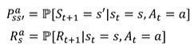

# 인공지능 기초 4주차

## 강화 학습

### What is RL

- A way of programming agents by reward and punishment without needing to specify how the task is to be achieved
- Specifiy what to do, but not how to do it
  - Through the reward function
  - Learning fills in the details
  - Feedback could be delayed, not instantaneous

### Model

- Goal : Find a control policy that will maximize the ovserved rewards over the lifetime of the agent
- A rewrad Rt is a scalar feedback signal

### Major Components of an RL Agent

- An agent may include one or more of these components
  - Policy : agent's behavior function
  - Value function : how good is each state and/or action
  - Model : agent's representation of the env

- Policy is a map from state to action
  - Deterministic Policy  : 함수 형식
  - Stochastic Policy : 확률 분포 형식

- Value function is a prediction of future reward
  - Used to evalutate the goodness/badness of states
  - and therefore sto select between actions

- Model predicts what the environment will do next

  - P predicts the next state

  - R predicts the next immediate reward

    

### Exploration and Exploitation

- Reiforcement learning is like trial-and-error learning
  - The agent should discover a good policy from its experiences of the env
  - Without losing too much reward along the way

- Exploration finds more information about the env
- Exploitation exploits known information to maximize reward

### Prediction and Control

- Prediction : evaluate the future
  - Find the value function
  - Given a policy

- Control: optimize the future
  - Find the best policy

---

## [마르코프 과정](https://ko.wikipedia.org/wiki/%EB%A7%88%EB%A5%B4%EC%BD%94%ED%94%84_%EA%B2%B0%EC%A0%95_%EA%B3%BC%EC%A0%95)

### Making a Single Decision

- Single decision to be made
  - Multiple discrete actions
  - Each action has a reward associated with it

- Goal is to maximize reward
  - Not hard: just pick the action with the largest reward

- State 0 has a value of 2
  - Sum of rewards from taking the best action from the state

### Markov Processes

- tuple(S, P)
  - A memoryless random process
  - A sequence of random states with the Markov property
  - A set of states S = {s1, s2, s3 ... }

- property
  - the state captures all relevant information from the history

### Markov Reword Processes

- A Markov reward process is an MP with values

### Why Discount Factor?

- All policies with a nonzero reward cycle have infinite value

