# 인공지능 기초 6주차

# 게임 이론

The decision-making process in situations where outcome depend upon choices made by one or more players

- Requirements for a game
  - least 2 players
  - Actions available for each player
  - Payoffs to each player for those actions

### Assumptions in Game Theory

1. All players want to maximize their utility
2. All players are rational
3. It is common knowledge that all players are rational 

### 죄수의 딜레마

### 공공의 비극

### Normal Form

Game is normal form defined by (N, A, u)

N : players, each indexed by i

A  : a set of actions, where A is a finite set of actions available to i 

u: Utility function that maps each set of action to a set of utilities 

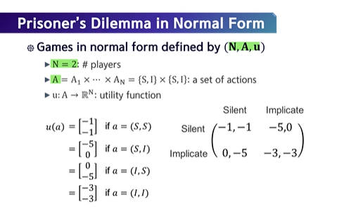

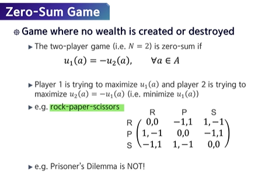

 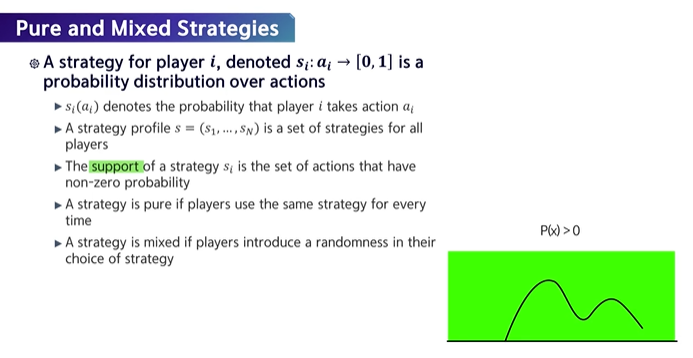

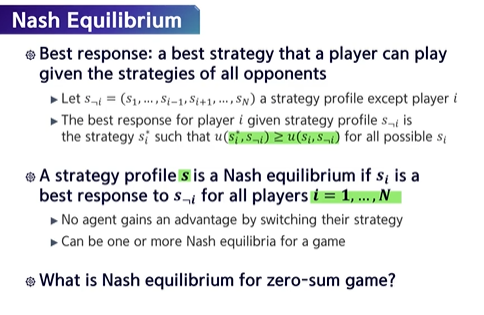

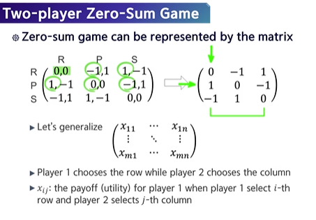

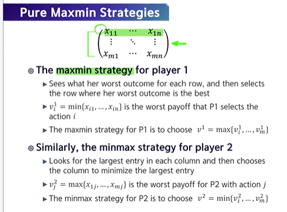

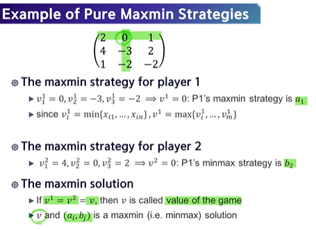

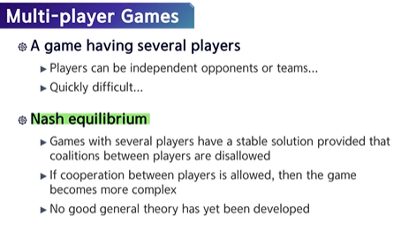

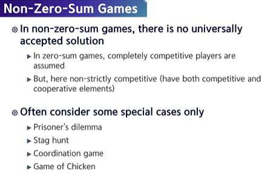

### Stag Hunt

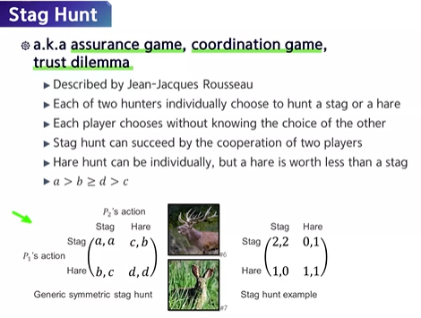

### Battle of the Sexes

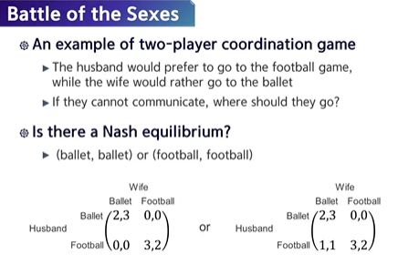

### Game of Chicken

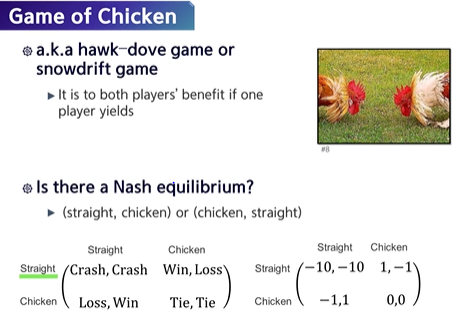

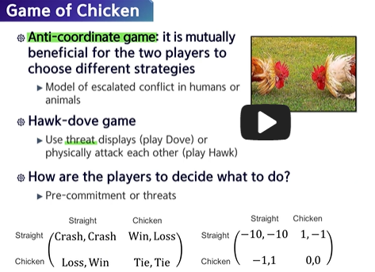

