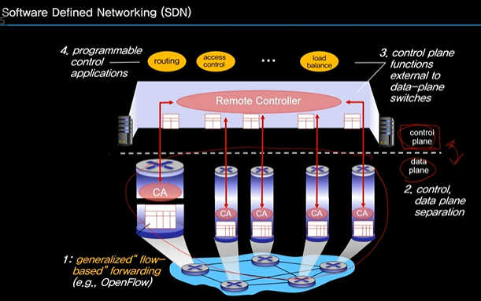
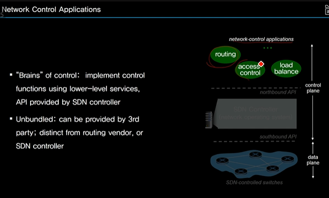

# Infra-/Inter-AS Routing and SDN

## Intra AS Routing OSPF

### Scalability of Routing

### Autonomous System

### Internet Approach to Scalable Routing

### Interconnected Ases

### Routing Protocols

### OSPF

- open shortest path first
- open => publicly available

## Inter AS Routing BGP

### Inter-AS Tasks

## Software Defined Networking

## OpenFlow

## Internet Control Message Port

## Keyword

\- Autonomous System (AS): 명확한 라우팅 정책을 가지고 동일한 네트워크 관리 주체에 의해 관리되는 네트워크, 네트워크의 집합 또는 도메인(domain)

\- AS 내부(Intra-AS) 라우팅: 같은 AS 내에 있는 라우터 간의 라우팅

\- AS 간(Inter-AS) 라우팅: 서로 다른 AS에 속한 라우터 간의 라우팅으로 사실상 표준인 Border Gateway Protocol (BGP)가 대표적임. 다른 도메인 간에 라우팅이 이루어지므로 성능보다 라우팅 정책이 중요함.

\- 소프트웨어 정의 네트워크(Software-Defined Network, SDN): 소프트웨어 기반의 중앙집중형 컨트롤러에 의해 유동적인 라우팅, 부하 균형(load balancing) 및 접근 제어가 가능한 새로운 네트워크 구조

\- 오픈플로우(OpenFlow): SDN 컨트롤러와 스위치 간의 통신 규약을 정의하는 대표적 Application Programming Interface (API)

\- 인터넷 제어 메시지 프로토콜(Internet Control Message Protocol, ICMP): 라우터를 포함한 네트워크 장비가 제어 정보를 보낼 때 사용하는 프로토콜로서 주로 오류 보고(error reporting) 메시지를 보냄

