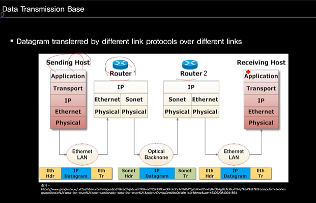
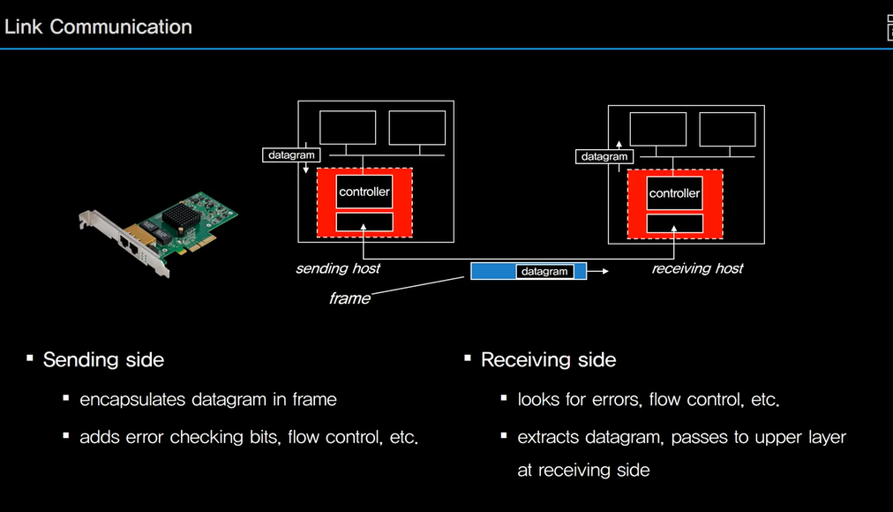
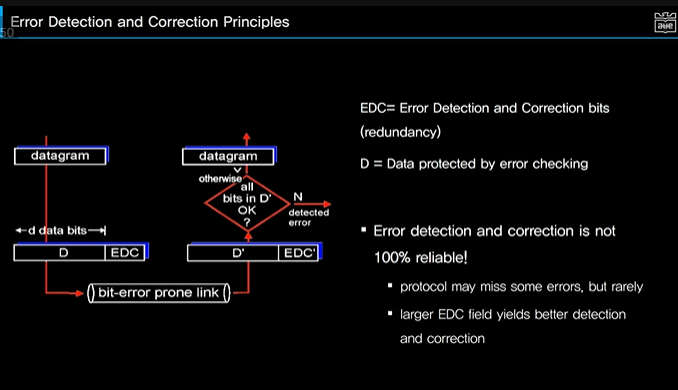
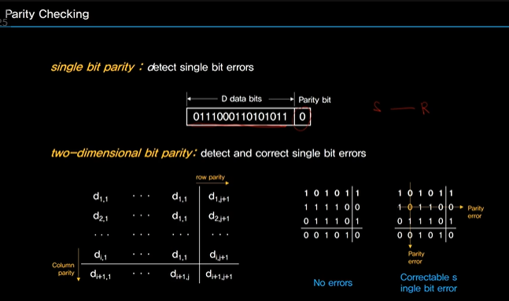
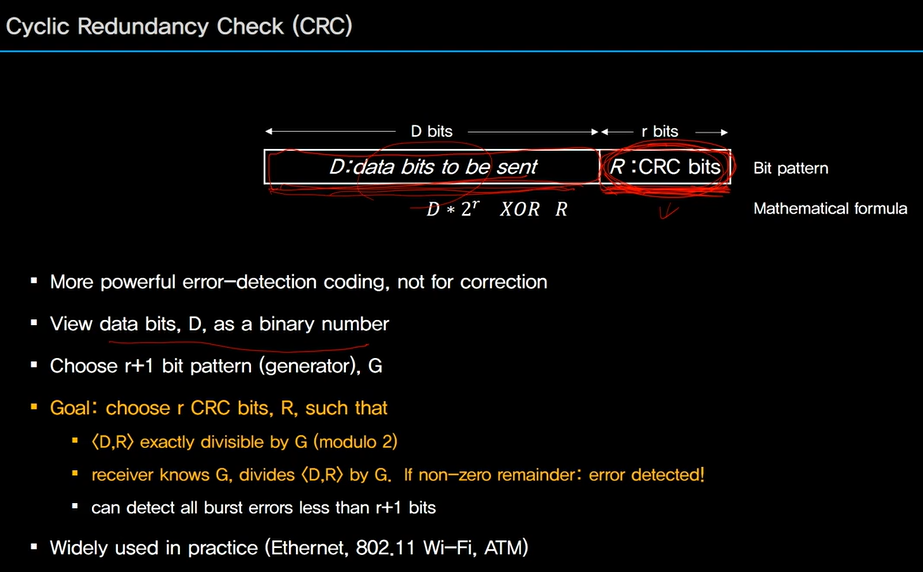
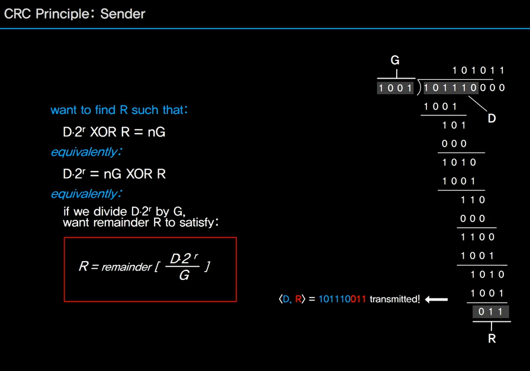
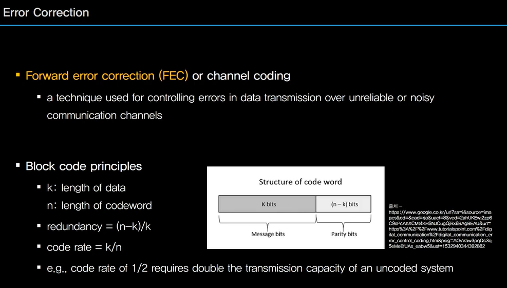
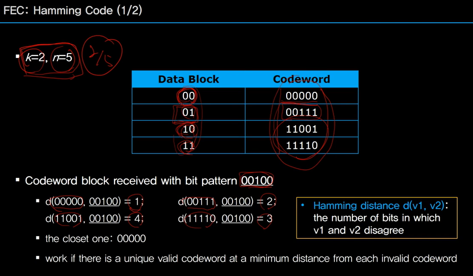
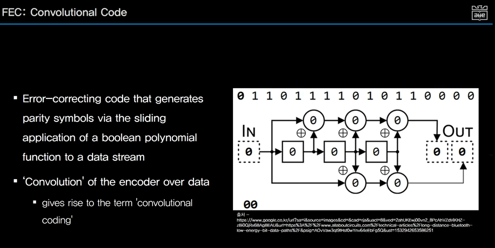

# Link Layer Services

## Link Layer Basics

- Node : host and router

- Link : communication channel that connects adjacent nodes along communication path'

- Frame : layer-2 packet, encapsulates datagram

  

### Link Layer Basic Functions

- Responsible for transferring datagram from one node to physically adjacent node over a link

  - bit error handling

  - packet collision handling

    

### Data Transmission Base

### Link Layer Services

## Error Detection and Correction

