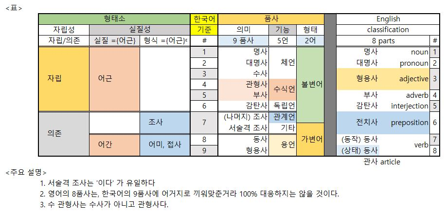

# Mental lexicon and words

## 문장의 구조: 통사론

### 문장은 무엇인가?

- 정보를 전달하는 최소의 기호
- 적합한 형식과 의미를 가져야 한다
- 적합한 형식: 단어 결합을 지배하는 원리인 <u>통사론</u>을 준수해야 한다
- 적합한 의미: 의미가 합성되는 원리인 <u>의미론</u>을 준수해야 한다

#### 문장의 형식

1. 통사론	
   - 단어들의 형식이 결합하는 원리
   - 문장의 통사 구조 syntactic structure 를 결정한다 

2. 기호를 결합하는 능력은 인간에게 고유하며 보편적이다.
   -  보편 통사론 

#### 통사 구조의 세 요소

1. 어순: 선형 배열에 따른 구조
2. 계층 구조: 결합 순서에 따른 구조
3. 구성성분들의 통사범주 

- 나무 그림을 사용해 통사 구조를 나타낸다 

- 통사 범주는 결합적 특성을 공유하는 표현들의 집합

  - 어휘 범주 - 품사 V N A P 등
  - 구 범주 - VP NP AP PP S 등
    - 어휘 범주가 수식어나 부사어 등과 결합한 표현의 통사 범주
    - 한 단어가 수식어나 부사어 없이 구 범주와 동일한 기능을 가질 때는 구 범주를 부여한다 

  

- [통사 구조 위키백과 파파고 번역](https://papago.naver.net/website?locale=ko&source=en&target=ko&url=https%3A%2F%2Fen.wikipedia.org%2Fwiki%2FSyntactic_Structures)

#### 통사규칙

- 문장의 통사 구조를 생성하는 규칙
- 어순, 계층 구조를 나타낸다

---

### 언어의 귀환성과 생성성 - 귀환적 통사론

#### 언어의 무한성과 귀한 규칙

- 무한한 의사소통 필요 -> 무한히 많은 종류의 문장을 생성하고 이해해야 한다
- 무상성을 보장한다 -> **<u>귀환 규칙</u>**
  - 한 문장 안에 동일한 구조를 반복적으로 생성하는 규칙 (**<u>내포와 접속 구조</u>**)
  - 어떤 언어에서나 귀환 규칙이 필요하다 (**<u>귀환 규칙의 보편성</u>**)

#### 귀환 구조

1. 보문절 complement clause 의 귀환

   S -> NP VP

   VP -> S V (영어 - V S)

   - <u>철수</u>가 <u>영희</u>는 <u>브라질</u>이 우승한다고 믿는다고 말했다.

2. 관계절 relative clause 의 귀환

   NP -> S N (영어 N S)

   S -> NP VP

   - 철수가 좋아하는 소녀를 만난 어린이가 싫어하는 ...

3. 명사구를 수식하는 전치사구의 귀환

   NP -> PP(NP - 의) N  (영어 - (Det) N PP)

   PP -> NP P (조사) (영어 - P NP)

   - 철수의 동생의 친구의 선생님의 제자 ...
   - the girl with the feather on the ribbon on the brim

#### 언어의 두 가지 귀환 구조

1.  embedding 내포
2. conjunction 접속

#### 언어 능력의 귀환성

- 인간 언어 능력의 핵심은 귀환적인 언어 구조를 생성할 수 있다는 것이다
- 인간과 다른 동물의 의사소통 능력을 구분해주는 가장 중요한 특성이다

----

### 어순 word order

- 보편 문법이 있다면 어순을 결정하는 원리가 없는가?
- O-V (N-P R-N) vs V-O (P-N N-R) 
- 어순 유형 일치는 무엇을 의미할까?
  - 보편 문봅에는 어순을 제약하는 원리가 있다
  - 모든 언어는 핵-선행 언어이거나 핵-후행 언어이다

---

### 변형 

- 통사구조를 바꾼다

#### 동의성, 형식과 의미의 불일치

- 형식이 다른 두 문장이 같은 의미를 갖는 이유는 무엇인가?

#### 중의성

- 왜 한 문장/형식이 둘 이상의 의미를 갖는가?

#### 변형은 두 문장 구조를 연결

- 둘 이상의 문장 구조가 특정한 형식과 의미를 공유할 때 연결해 주는 통사적 연산

1. 삭제 변형

   John was listening to Beethoven, and Mary was ~~listening to Beethoven~~ too

2. 이동 변형 

   어디에서 철수가 영희를 ___ 만났니?

   - 이동 변형은 흔적을 남긴다

#### 수량 해석의 중의성

- 두 양화사의 상호작용에 의해 두 가지 의미로 해석 된다 

#### ***<u>변형에 대한 제약</u>***

- 이동 변형에 대한 제약

  - *<u>국지성 조건 locality condition</u>*

    원래 위치에서 너무 멀리 움직일 수 없다.

- 삭제 변형에 대한 제약
  - *<u>복원 가능성 조건 recoverability condition</u>*