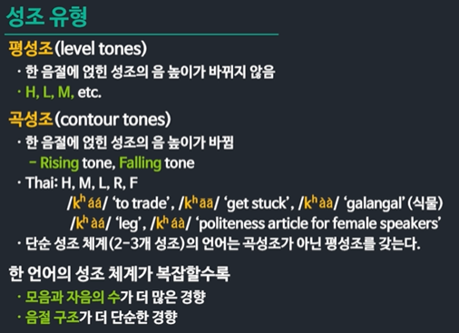
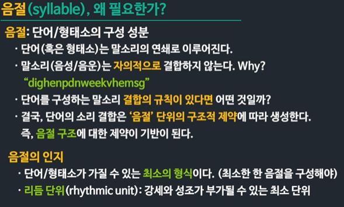

# Sound patterns of language

# 말소리의 구조

## 모음과 자음 Vowels and consonants

### 두 가지 말소리

- 입에서 나는 말소리 : 음성 phones
  - 음성학
- 마음 속의 말소리 : 음운 phonemes
  - 음운론 

### 말소리를 만드는 기관들

- 음성기관 vocal organs

- 발동부 허파 
  - 공기의 흐름을 발생시키면서 발성의 에너지를 제공한다

- 발성부 성대
  - 성대 진동은 공기의 흐름에 규칙적인 울림을 발생시킨다
  - 유성음과 무성음이 구분되는 곳

- 조음부 후두~입술, 코
  - 공깃 길의 모양을 세밀하게 변화시키면서 공기 흐름을 다양한 말소리로 변형시킨다 

### 유기음과 무기음

- 유기음 
  - 기류가 개방된 후 공기가 자유롭게 방출된다
  - 뒤따르는 모음의 성대 진동이 지체됨

- 무기음 
  - 기류 개발과 동시에 성문이 닫히며 긴장하고 
  - 곧바로 성대 진동 시작 

### 성대진동 개시 시간 VOT

#### Voice Onset Time 

- 파열음과 발음할 때 기류 개방 이후/이전 성대 진동이 시작되는 시간

- 유성음
  - 입술이 열리기 전부터 성대 진동
- 무성 무기음
  - 입술이 열리면서 성대 진동
- 무성 유기음 
  - 입술이 열린 후 성대 진동

### 모음

- vowels
- 성대 진동으로 인한 공기 울림을 수반한다
- 성대를 지난 기류가 공명강을 통해
  - 기류는 거의 방해를 받지 않는다
  - 공명강 resonanace cavity 의 모양에 따라 음가가 결정된다
    1. 인두강 혀 뒤쪽 공간
    2. 구강 혀 앞쪽 공간
    3. 입술 공간 rounded vowels
    4. 비강 nasal vowels  

### 입안 모양에 따라 모음 구분

- 혀의 높이 - 턱이 벌어지는 정도 
- 혀의 부분 - 최고점이 되는 혀의 부분
  - 즉 혀의 어떤 부분이 얼마나 높은 위치에서 발음되는가에 따라 공명강(구강과 인두강)의 형태가 결정된다

- 입술 모양 - 원순 모음/평순 모음 
- 비강의 개방 여부 - 비 모음/구강 모음

## 마음 속의 소리 음소

## Speech sounds in mind: Phoneme

### 두 가지 말소리 

#### 입에서 나는 말소리: 음성 phones

- 음성학 phonetics

#### 마음에서 나는 말소리: 음운 phonemes

- 음운론

- 마음 속 말소리에 대한 연구

  

### 마음 속에서 작동하는 음성적 특징들

- 변별적 자질
  - 마음 속에서 음운들을 구분해 주는 음성적 특징
  - 심리적 실재 
  - 단어의 의미 구분

- 비변별적 자질
  - 마음 속 음운들을 구분해 주지 못한다
  - 물리적/음향적 차이가 있으나 심리적으로 구분하지 않는다
  - 따라서 단어의 의미를 구분하지 않는다

언어마다 변별 자질과 비변별 자질의 구성이 다르다

## 말소리 결합 규칙

