# Language Acquistion

# 언어 습득

## 언어 습득 단계

### 제 1언어 습득

### 언어 발달은 뇌와 인지의 발달과 함께

태아기로부터 아동기를 거치며 

- 언어 발달은 매우 빠르다
- 보편적인 연역적 습득 과정을 거친다
- 뇌 발달, 인지 발달과 병행한다

인간 언어의 본질을 밝히기 위해 언어 습득에 대한 연구는 매우 중요하다 

제 1언어와 제 2 언어 습득 양상은 언어능력의 생득력과 지능 발달에 많은 시사점을 준다 

### 언어 습득 단계

1. 옹알이 단계

   - 영아기 생후 6개월
   - 태아기 34-40주 엄마의 말소리와 익술한 노래 선호 (박동 완화)
   - 생후 수 일째: 모어와 비모어의 말소리에 달리 반응한다
   - 생후 수 주째 : 엄마의 말소리를 인식한다
   - 1개월 경 말소리의 음성적 차이를 인식한다
   - 6-8개월 경까지 모어/비모어의 음운적 대립을 인식한다, 말소리 산출 (옹알이 단계)
     - 모어와 관계없이 보편적인 옹알이 단계의 특성을 보인다 
   - 6-8개월 이후: 비모어의 음성적 대조를 읽어버리기 시작한다. 모어의 음성적 대조에 민감해진다 

2. 한 단어 단계

   - 18개월 경 : 50 개 단어 
   - 24개월 경 : 150 ~ 300 개 단어 
   - 음운 습득과 의미 구분
     - 소리 차이로 의미 차이를 이해한다 

   - 어휘 습득 전략
     1. 개체 기반 어휘 습득
     2. 기초 유형 기반 어휘 습득 
        - 개체 유형을 지시한다 
        - 기본적으로 유사한 형상의 개체들의 유형을 지시한다 

3. 전보체 단계

   - 조동사 등 기능어 없음
   - 동사의 형태 변화 규칙을 아직 습득하지 못함 
   - 두 단어 결합의 통사와 의미
     - 두 단어 결합의 의미 관계 구분 
     - 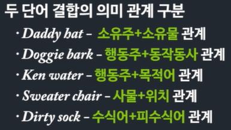
     - 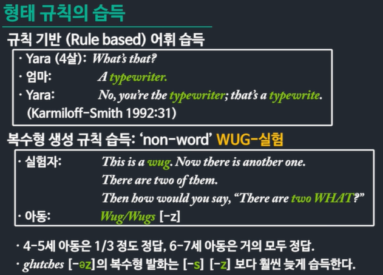
     - 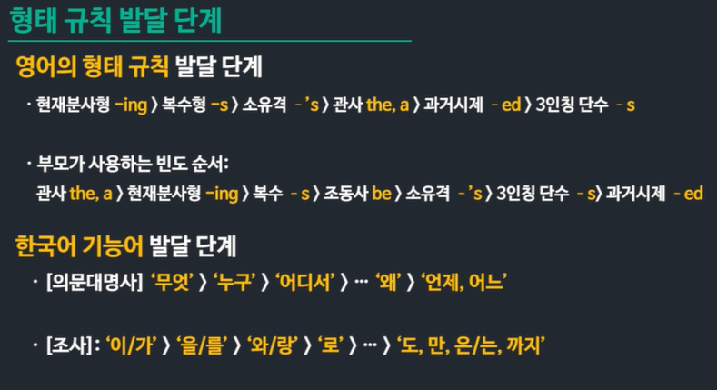

4. 성인 문법 단계

   - 5살 이후 
   - 1만 단어 전도 습득
   - 기능어와 어형 변화가 나타나기 시작한다 
   - 복잡한 문법 규칙들이 습득된다 
   - 어휘부의 습득은 평생 계속된다 

## 결정 시기 가설

### 생득성과 결정 시기 가설

### 언어 습득은 문법의 습득이다 

단순한 문장의 암기가 아니다 

습득 과정은 연역적이다 

### 부모 교정 기능은?

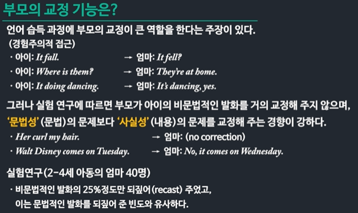

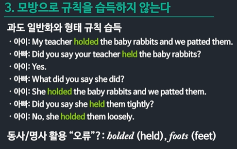

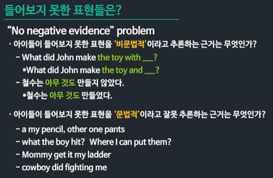

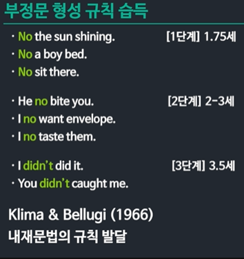

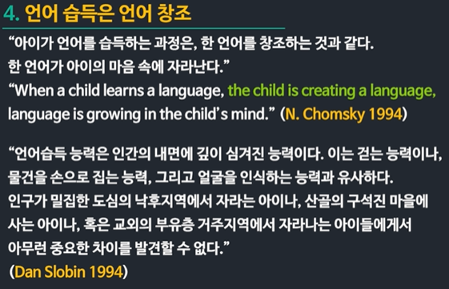

### 보편 문법: 원리와 매개 변항

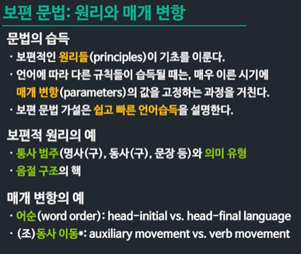

### 조동사 이동의 매개 변항

### 결정 시기 가설 

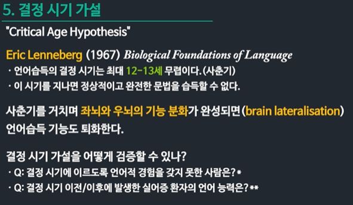

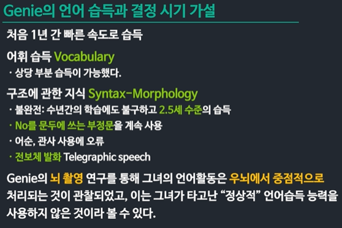

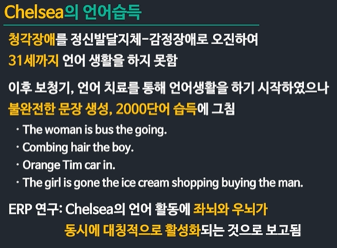

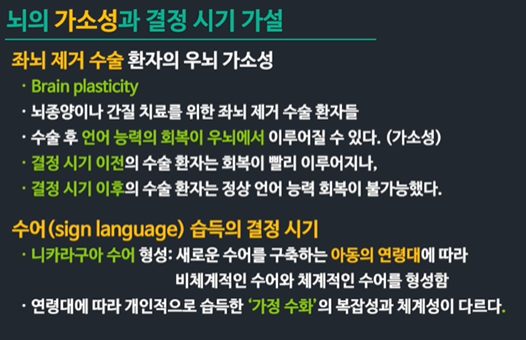

## 이중 언어와 제 2언어 

 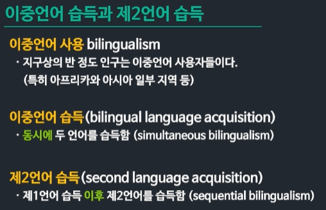

### 이중 언어 사용의 실제

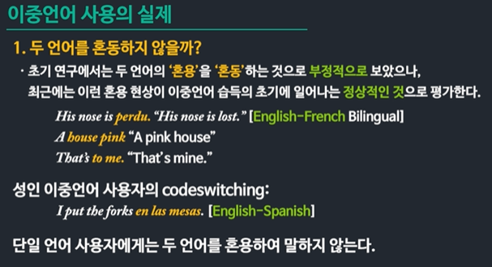

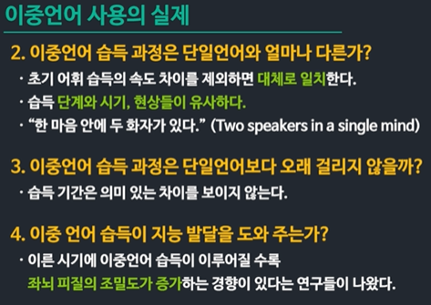

### 이중 언어 습득의 문법 모델

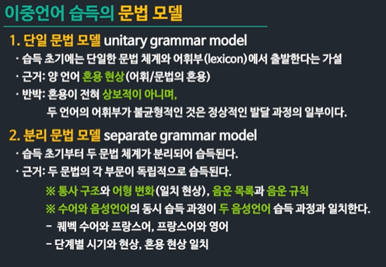

### 제 2 언어 습득과 중간 언어

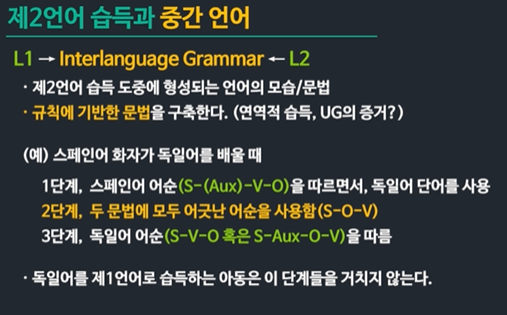

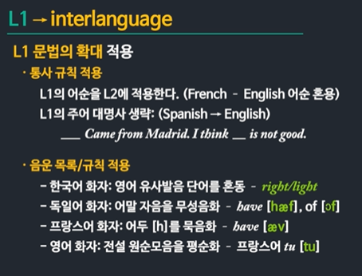

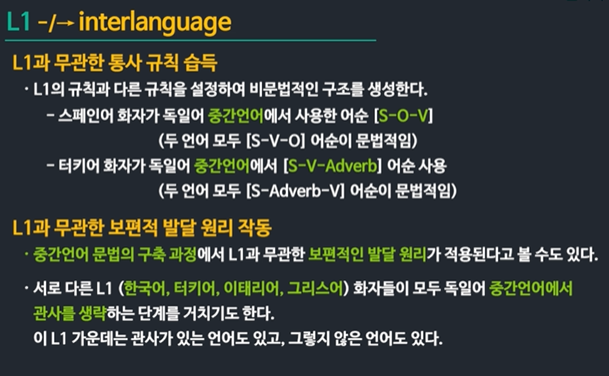

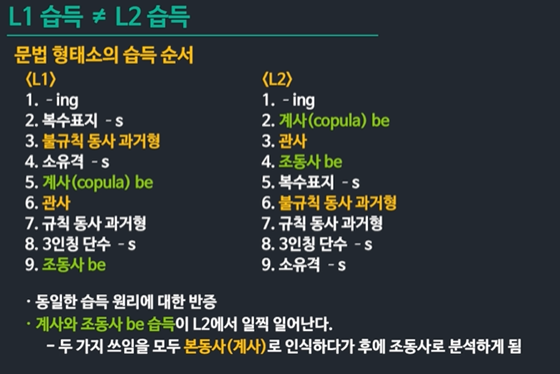

### 제 2 언어 습득의 요인

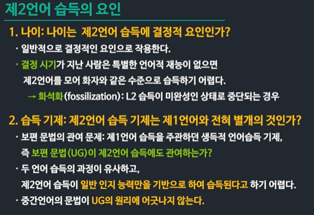

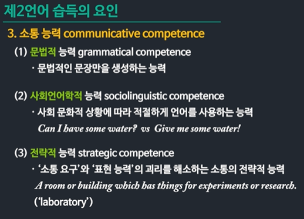

### L2 습득과 뇌 발달

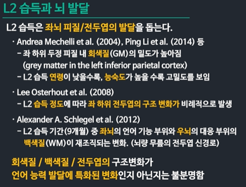

### L2 습득과 알츠하이머 발병 시기 

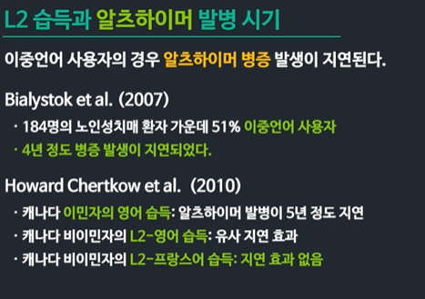

