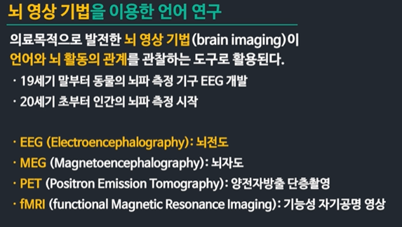
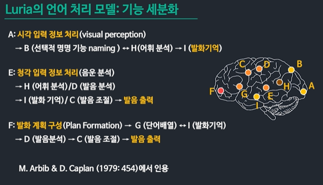
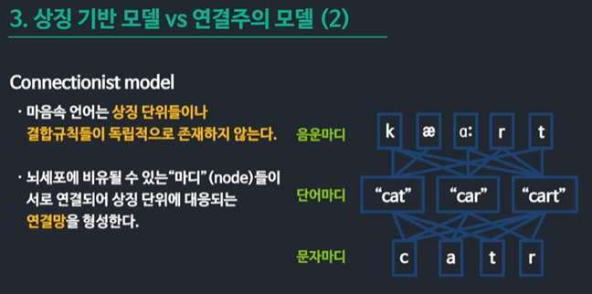

# Language in Human Brain

# 뇌와 언어능력

## 뇌의 언어처리

### 뇌의 발달

- 태아 출생시 천억 개 정도의 신경 세포를 가짐

- 출생 후 3년 동안 수많은 시냅스가 만들어지고 사용되지 않고 소멸되기도 하며

- 어떤 것들은 많이 쓰이며 기능이 강화되고 뇌의 기초 구조를 구축한다 

- 유아의 뇌는 성인의 뇌보다 더 많은 변화 가능성을 가진다 

  

- 4세부터 12세까지 : 아동기와 사춘기 
  - 새로운 경험과 학습에 의해 뇌신경 연결망이 발달한다 
  - 발달 속도는 3세 이전보다 훨씬 느리다

- 사춘기를 지나친 아동의 뇌의 구조 발달이 급격히 약화된다
  - 언어습득의 결정시기 가설의 근거가 된다 

### 뇌의 구조 

- 좌뇌 - 분석적이고 이성적 기능 (수리적, 언어적, 논리적)
- 우뇌 - 종합적이고 감성적 기능 (공간적, 예술적, 직관적)

#### 뇌 손상과 언어 장애

- 자뇌 손상시 심각한 언어 기능 장애가 있지만 이런 경우 우뇌에서 그 기능을 담당하면서 회복되는 현상이 일어난다 
- 우뇌 손상시는 정산적인 아동과 같이 언어습득이 가능하다 

### 심리 언어학

- 심리적 언어 처리 원리와 과정에 대한 연구 

1. 화자나 청자의 행동을 관찰하는 방법
   - 언어 행위
   - 눈의 움직임

2. 뇌 활동을 관찰하는 방법
   - 뇌 영상 기법

### 발화 오류 / 말실수 

### 마음을 들여다 보는 반응 실험들

### ERP 에 드러나는 언어처리 양상

## 언어의 통합적 인지

### 뇌의 언어 정보 처리 모델

### 언어 처리 심리 모델

### 직렬 처리 모델과 병렬 처리 모델

### 발화의 이해와 생성 과정

### 단일 경로 모델 이중 경로 모델

### 상징 기반 모델 연결주의 모델

### 심리적 언어 처리 모델의 평가

## 실어증과 뇌 기능

