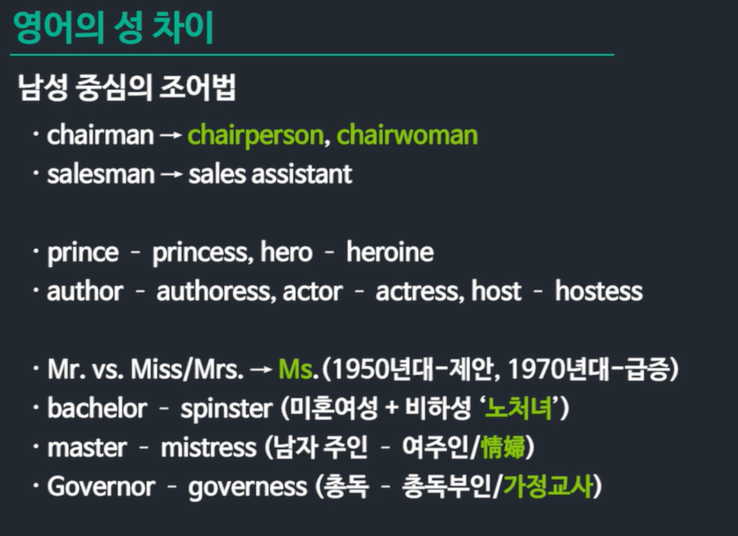

# Language in Society

# 언어와 사회

## 지역 방언

### 언어의 여러 얼굴들

언어 지식과 수행

음성 언어와 수어

공시태와 통시태

공시태의 언어 변이

- 지역 방어 
- 개인 방어
- 사회 방어 

### 언어와 사회의 상호작용

사회언어학

- 언어에 반영된 사회 구조적 요인들을 연구한다 
- 한국어는 방언, 경어법, 호칭어 연구에서 시작됨

사회의 구조적 요인들

지역: 계층/신분, 직업, 성, 민족성, 권력/힘

지역 방언: 지역에 따른 언어 변이형

사회 방언: 사회 구조적 요인에 따른 언어 변이형

### 방언이란

- 한 언어에 속해 있어서 서로 이해할 수 있지만 또한 서로 체계적인 차이점을 보이는 언어 변이형들

- 또한 서로 체계적인 차이점을 보이는 언어 변이형들

- 상호 이해 가능성과 정치-문화적 요인

  

## 언어 접촉: 다언어 사회

### 사회 방언

- 사회 계층이 높은 계층일수록  'r' 을 발음함

## 언어와 성

## 단어 형성의 역학: 신어형성

### 다언어 사용의 언어 접촉 상황

