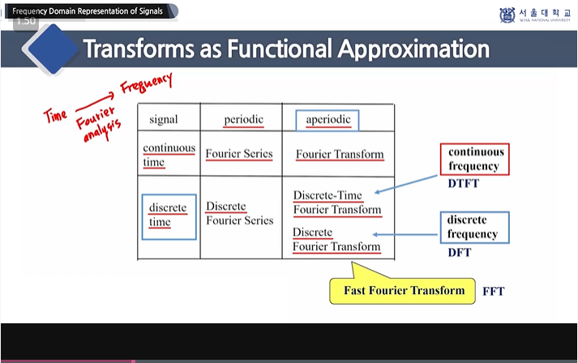

# 언어학과 인공지능 4주차

## 음성신호의 수학적 모델링

### Sampling and Quantization

- Signal Processing
  1. Information Source (sensor)
  2. Measurement / Observation (analog signal)
  3. Signal Representation (digital signal)
  4. Signal Transformation (특성 추출, 변환 표현)
  5. Extraction / Utilization of Information (유용한 정보) 

- Speech Signal Processing 분야

- Analog-to-Digital A/D conversion

  1. Analog Speech Signal x(t)

  2. Discrete-Times Speech Signal x(n) = x(nTs) 

     n 은 정수, Ts(sec) = sampling period, Fs(Hz) = sampling frequency

     Fs = 1 / Ts

  3. Quantization
  4. Representation of Discrete - Time signal

### Linear Time-Invariant System and Convolution

- System
  - Continuous-time System
  - Discrete-time System 

- [Linear Time-Invariant System](https://ko.wikipedia.org/wiki/%EC%84%A0%ED%98%95_%EC%8B%9C%EB%B6%88%EB%B3%80_%EC%8B%9C%EC%8A%A4%ED%85%9C)
  - additive - 여러 신호가 합해 입력되면 출력을 신호마다 계산하여 합해도 된다
  - homogeneous - 상수배된 신호 입력시 상수배를 하여 출력값을 구할 수 있다 

- [Convolution](https://m.blog.naver.com/PostView.naver?isHttpsRedirect=true&blogId=cj3024&logNo=221229839852)
  - impulse response

### Frequency Domain Representaion of Signals

- Functional Approximation

  - 함수 해석학 -> function approximation 

  - transforms

    - [푸리에 변환 위키백과](https://ko.wikipedia.org/wiki/%ED%91%B8%EB%A6%AC%EC%97%90_%EB%B3%80%ED%99%98)

    - 

### Nyquist Sampling Frequency Domain

- 빠르게 샘플링하고 중간에 소실된 값들을 복원한다
- Frequency-Domain Representation of Sampling
- 표본화 정리

### Frequency Domain Characteristics of Speech Signal

