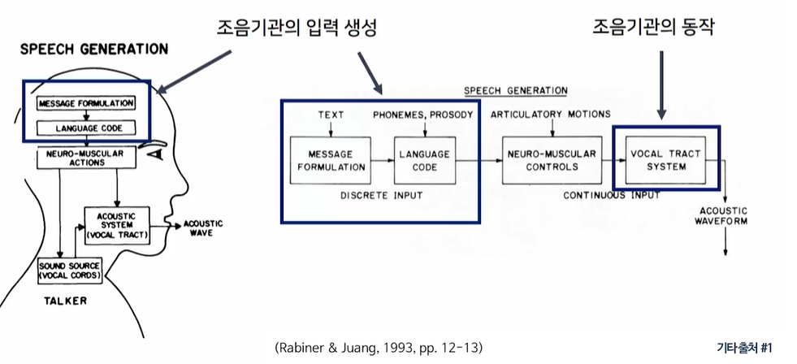

# 언어학과 인공지능 5주차

# 인간은 어떻게 말을 하고 알아듣는가?

## 5-1 인간의 조음과 청지각 과정

### 조음과정

### 청지각 과정

---

## 5-2 조음과 계산 모델

- 발동 initiation : 기류 air stream 생성
  - 대부분 말소리는 폐에서 발동된다
  - 폐에서 발동된 기류는 공기의 흐름에 불과할 뿐 말소리 성격은 띠지 않는다

- 발성 phonation : 기류의 1차 변형 -> 말소리의 기본 성격 형성
  - 기류는 후두를 통과하면서 성대의 작용에 의해 변형되어 말소리의 기본 성격을 가진다
  - 하지만 특정 음가를 가지지 않는다

- 조음 articulation : 기류의 2차 변형 -> 음가의 형성

### Voiced Sound 유성음

- 폐로부터 올라오는 기류가 후두를 통과하는 동안 성문을 좁히고 긴장된 성대를 빠르게 진동시키면서 발생한다
- 국어에는 모음, 반모음, 비음, 유음이 이에 속한다 
- 발성시 폐로부터 후두부로 유사 주기적인 기류가 공급된다 
- 주변 음소와의 동시 조음 영향 때문에 트랜지션 구간이 생기고 안정 구간에서 그 유성음의 특징을 보여주는 주기적인 기류가 공급된다 
- quasiperiodic pulse train 형태로 유성음은 소리값을 가지게 된다 

### Fundamental Frequency

- 유성음 발성시 성대가 진동하는 주파수를 기본 주파수 Fundatmental frequency F0 라고 한다 
- 성도는 공기가 차 있는 관으로 구강, 비강, 순강, 인강으로 구성된다 

- 소리가 울리는 공명기로 작용하며 성도에서의 공명은 기본 주파수의 배음으로 이루어진다
- 소리의 높이는 성대 진동횟수인 기본 주파수에 의해 결정된다
- 성대의 진동 속도가 빠를수록 높은 소리가 발음된다
- 기본 주파수 F0 의 역수인 성대 진동 주기를 pitch 라고 한다 

### 무성음과 파열음의 생성원리

- 소리통의 특성에 따라 공명이 이루어지는 주파수 값들이 달라진다
- 주파수 성분값은 resonance 와 antiresonance로 이루어진다 
- resonance 가 일어나는 주파수 값을 formant frequency라고 한다 
- formant frequency  값은 Vocal tract 의 모양에 따라서 달라지게 된다
- formant 값들이 많지만 주로 F1, F2 값을 사용해서 유성 모음을 구분한다 

### 조음 과정의 계산 모델

---

## 5-3 청지각과 계산 모델

귀의 구조 = 외이 + 중이 + 내이

### 인간의 청지각 과정

소리는 공기입자들이 압력에 의해서 변화되면서 전파되는 압력파이다

압력의 변화는 고막을 기계적으로 진동시키며 순차적으로 달팽이관의 기저막의 진동으로까지 이어진다

기저막에 연결된 청각 신경은 진동을 전기 화학적인 변화로 바꾸어 신경 충격파 형태로 변환하고 뇌로 전달한다

---

