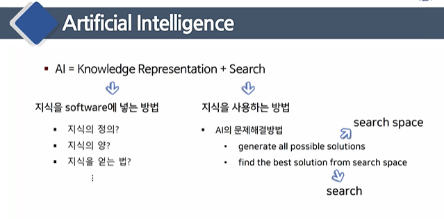

# 언어학과 인공지능 6주차

# 패턴인식과 음성인식

## 패턴 인식

- 패턴 = data structure of features
- raw data 를 사용하지 않고 잘 정리된 요약 정보를 사용해서 문제를 해석한다 
- 가장 많이 사용되는  패턴 = feature vector or feature vector sequence

 

- answer = arg max score 

## 음성 인식

신호 구간 : 신호 + 잡음

사일런스 구간 : 잡읍 

잡음 제거 과정이 필요하다 

