# 음성합성은 어떻게 이루어지는가?

## 음성합성 시스템의 구성

### 음성합성을 위한 음성학

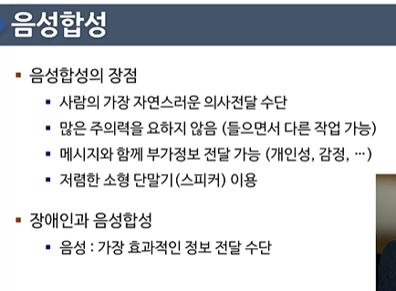

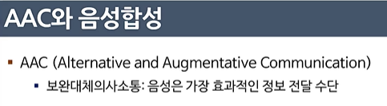

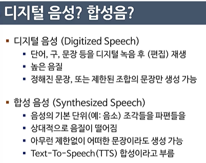

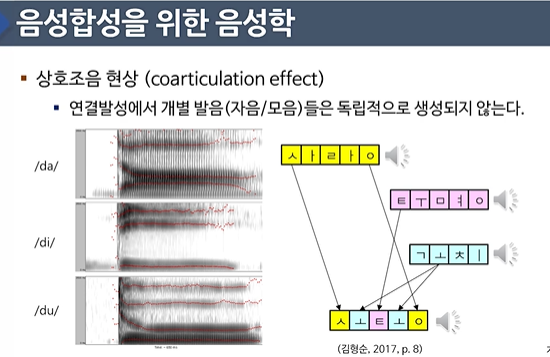

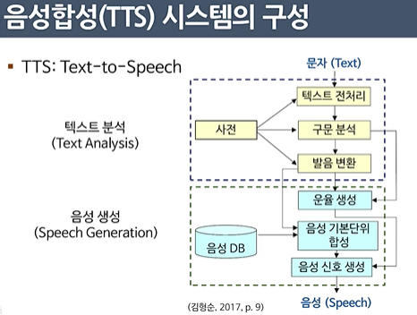

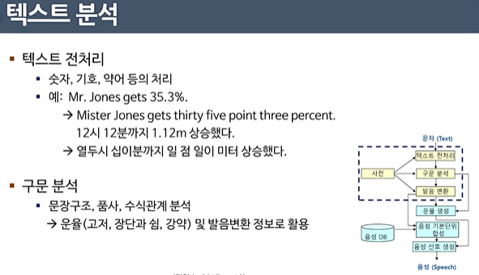

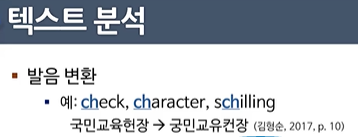

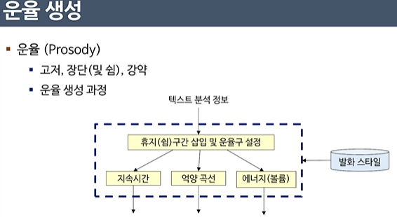

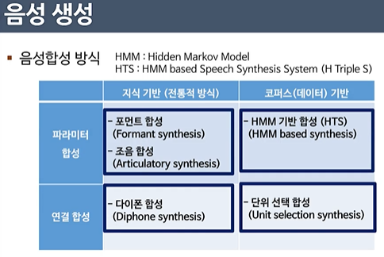

## 음성합성 방법

- 포먼트 합성 
  - 포먼트 - 구강 내의 공명 주파수
  - 음성 전문가에 의한 포먼트 변화 규칙을 통해 합성음 생성

- 조음 합성
  - 사람의 조음 기관을 직접 모사

- 연결 합성
  - 음성 데이터베이스를 기반으로 개별 단위로 편집하여 합성

- 다이폰 연결 합성

  - 연결 합성 방식의 일종으로 다이폰을 기본 단위로 사용

  - 다이폰: 함 음소의 중심에서 다음 음소의 중심까지의 단위
    - 음소 간 연결 부분의 천이 특성을 보전
    - 개수는 언어에 따라 다르나 대략 1000개 내외 

  - 운율(고저, 장단, 강약) 조정은 신호처리 기술을 통해 해결

    - 원음에서 많이 변경될수록 음질 저하 문제 발생

      

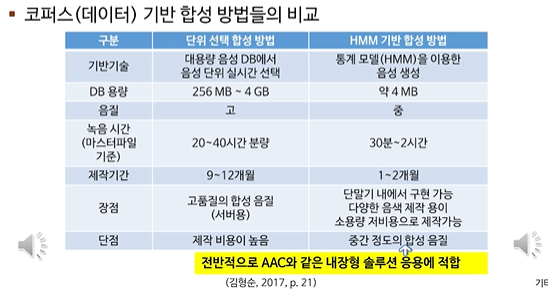

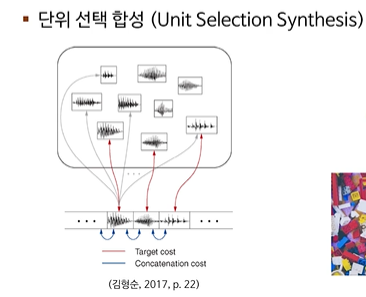

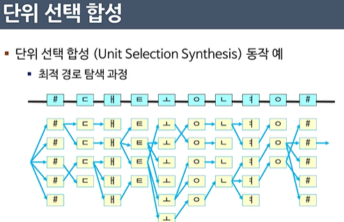

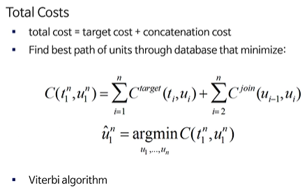

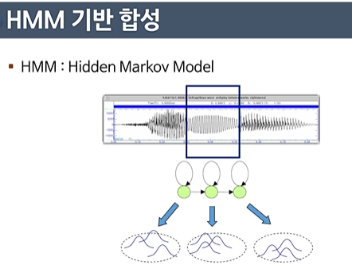

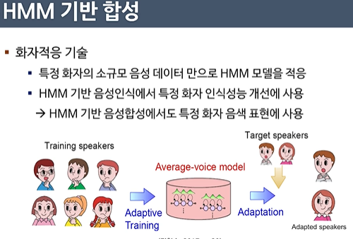

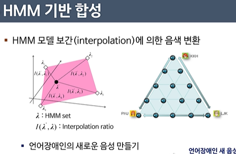

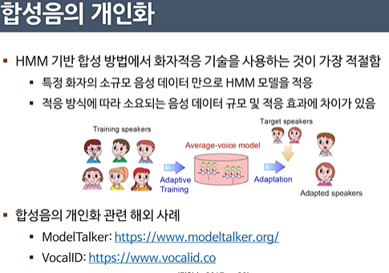

